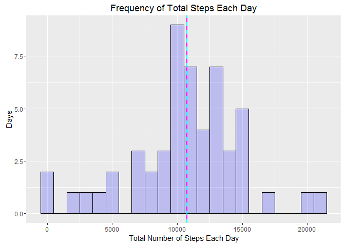
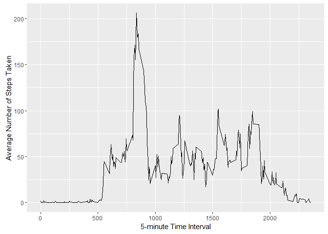
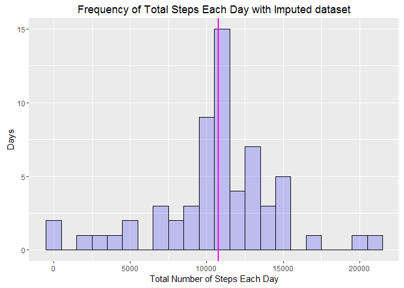
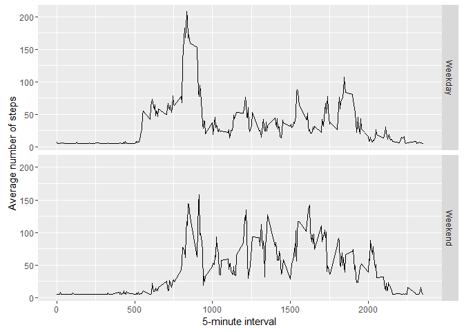

# Reproducible Research: Peer Assessment 1
Ajit Nambissan  
9 July 2016  


## 1. Loading and preprocessing the data


- Including R package libraries used


```r
library(dplyr)
library(ggplot2)
library(Hmisc)
```


- Loading the data (i.e. read the activity.csv file)


```r
if (!file.exists('activity.csv')) {
  unzip('activity.zip')
}

activity <- read.csv('activity.csv', colClasses=c('numeric', 'character', 'numeric'))
```


- Checking the loaded data with head and str


```r
head(activity)
```

```
##   steps       date interval
## 1    NA 2012-10-01        0
## 2    NA 2012-10-01        5
## 3    NA 2012-10-01       10
## 4    NA 2012-10-01       15
## 5    NA 2012-10-01       20
## 6    NA 2012-10-01       25
```

```r
str(activity)
```

```
## 'data.frame':	17568 obs. of  3 variables:
##  $ steps   : num  NA NA NA NA NA NA NA NA NA NA ...
##  $ date    : chr  "2012-10-01" "2012-10-01" "2012-10-01" "2012-10-01" ...
##  $ interval: num  0 5 10 15 20 25 30 35 40 45 ...
```


- Preprocessing

    + Converting date field from character to date
    + Obtaining the complete cases (omitting rows with NA)


```r
activity$date = as.Date(activity$date)

complete <-  na.omit(activity)
```


## 2. What is mean total number of steps taken per day?


- Aggregating the total steps taken per day using dplyr package
- Getting the mean and median of the steps taken each day
- Plotting the Histogram of total steps taken each day


```r
stepsPerDay <- aggregate(steps ~ date, data=complete, sum)
Mean <- mean(stepsPerDay$steps, na.rm=TRUE)
Median <- median(stepsPerDay$steps, na.rm=TRUE)

ggplot(stepsPerDay, aes(x=steps, fill=date)) +
    geom_histogram(binwidth=1000, colour="black", fill="blue", alpha=0.2 ) +
    xlab("Total Number of Steps Each Day") + ylab("Days") +
    geom_vline(aes(xintercept=mean(steps, na.rm=T)),  
               color=Mean, linetype="solid", size=1) +
    geom_vline(aes(xintercept=median(steps, na.rm=T)),  
               color=Median, linetype="dashed", size=1) +
    ggtitle("Frequency of Total Steps Each Day")
```

<!-- -->

```r
Mean
```

```
## [1] 10766.19
```

```r
Median
```

```
## [1] 10765
```


## 3. What is the average daily activity pattern?


- The time series plot of average number of steps taken for 5 minute interval


```r
stepsByInterval <- aggregate(steps ~ interval, data = complete, mean)

ggplot(data=stepsByInterval, aes(x=interval, y= steps)) +
    geom_line() +
    xlab("5-minute Time Interval") +
    ylab("Average Number of Steps Taken")
```

<!-- -->


- The 5-minute interval that, on average, contains the maximum number of steps


```r
stepsByInterval[which.max(stepsByInterval$steps), ]
```

```
##     interval    steps
## 104      835 206.1698
```


The maximum number of steps are taken at time interval 08:35 a.m. and on an average, 206.2 steps are taken during this interval.


## 4. Imputing missing values


The given activity dataset contains rows with missing values (rows with NA). The presence of this missing data could introduce bias into some calculations and summaries of data. 

The strategy for imputing missing values is as follows:

- For the interval that has missing data, fill in the value as mean of that 5-minute interval. Create a new dataset that has all the original activity data and the missing values filled in

- Using the new dataset, 
    + plot the histogram of the total steps taken each day 
    + calculate the mean and median of the total steps taken each day
    
- compare these results with the original results and comment on differences (if any) and the impact of imputing the missing data


a. Finding the number of rows with missing values:


```r
sum(is.na(activity$steps))
```

```
## [1] 2304
```


b. Filling in the missing values with the average of the 5-minute interval:


```r
activityImputed <- activity   # create a new dataset by copying the original
activityImputed$steps <- impute(activityImputed$steps, mean)
```


c. Plotting the histogram of the total number of steps taken each day


```r
stepsByDay <- aggregate(steps ~ date, data=activityImputed, sum)
imputedMean <- mean(stepsByDay$steps, na.rm=TRUE)
imputedMedian <- median(stepsByDay$steps, na.rm=TRUE)

ggplot(stepsByDay, aes(x=steps, fill=date)) +
    geom_histogram(binwidth=1000, colour="black", fill="blue", alpha=0.2 ) +
    xlab("Total Number of Steps Each Day") + ylab("Days") +
    geom_vline(aes(xintercept=mean(steps, na.rm=T)),  
               color=imputedMean, linetype="solid", size=1) +
    geom_vline(aes(xintercept=median(steps, na.rm=T)),  
               color=imputedMedian, linetype="dashed", size=1) +
    ggtitle("Frequency of Total Steps Each Day with Imputed dataset")
```

<!-- -->

```r
imputedMean
```

```
## [1] 10766.19
```

```r
imputedMedian
```

```
## [1] 10766.19
```

As can be seen, there is not much difference in the mean and median figures of the original and imputed data. Only the frequency around the average steps in a day has increased since all the NA occurances are now replaced with the mean value.


## 5. Are there differences in activity patterns between weekdays and weekends?


- Adding a new factor variable in the activity dataset indicating if the date of the activity is a weekday or a weekend


```r
daytype <- function(date) {
    if (weekdays(as.Date(date)) %in% c("Saturday", "Sunday")) {
        "Weekend"
    } else {
        "Weekday"
    }
}
activityImputed$daytype <- as.factor(sapply(activityImputed$date, daytype))
```


- Plotting the average interval steps taken per day for the weekend and weekday 


```r
avgActivityImputed <- aggregate(steps ~ interval + daytype, data=activityImputed, mean)
ggplot(avgActivityImputed, aes(interval, steps)) + 
    geom_line() + 
    facet_grid(daytype ~ .) +
    xlab("5-minute interval") + 
    ylab("Average number of steps")
```

<!-- -->


It is observed that the activity patterns for this person are different on weekdays and weekends. 

On weekdays, there is a large spurt of activity between approximately 08:00 a.m and 09:00 a.m. and then it is lower for the rest of the day, with short spurts around noon time and again in the evening.

The person shows more regular activity during the weekends.
